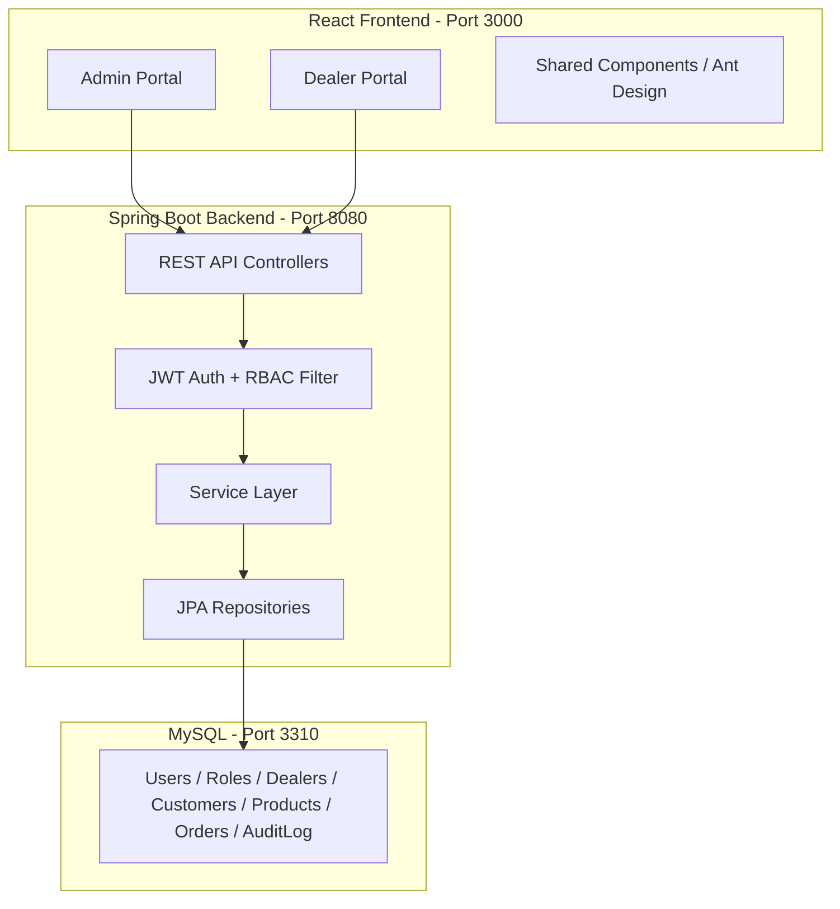
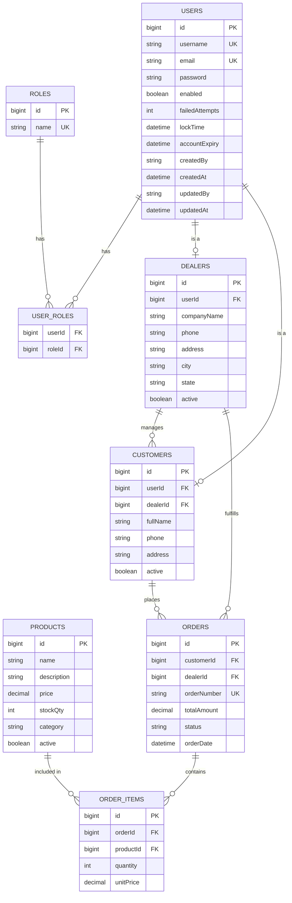

# SeMS - Serene Dealer Management System

## Architecture




## Tech Stack

- **Backend:** Spring Boot 3.2, Java 17, Spring Security, Spring Data JPA, JWT (jjwt), Lombok, MapStruct, Springdoc OpenAPI (Swagger)
- **Frontend:** React 18, TypeScript, Ant Design (professional UI library), Axios, React Router v6, React Query
- **Database:** MySQL 8 on port 3310 (root / 1234), HikariCP connection pool (Spring Boot default)
- **Build:** Maven (backend), Vite (frontend)

---

## Project Structure

```
SeMS/
├── backend/
│   ├── pom.xml
│   └── src/main/java/com/serene/sems/
│       ├── SemsApplication.java
│       ├── config/          (SecurityConfig, CorsConfig, OpenApiConfig)
│       ├── security/        (JwtProvider, JwtFilter, UserDetailsServiceImpl)
│       ├── controller/      (AuthController, UserController, DealerController, CustomerController, ProductController, OrderController)
│       ├── service/         (business logic layer)
│       ├── repository/      (Spring Data JPA repos)
│       ├── model/           (JPA entities)
│       ├── dto/             (request/response DTOs)
│       ├── exception/       (GlobalExceptionHandler, custom exceptions)
│       └── audit/           (AuditAware, base entity with createdBy/updatedBy/createdAt/updatedAt)
│   └── src/main/resources/
│       ├── application.yml
│       └── data.sql         (seed: admin user, default roles)
├── frontend/
│   ├── package.json
│   ├── tsconfig.json
│   ├── vite.config.ts
│   └── src/
│       ├── main.tsx
│       ├── App.tsx           (routing shell)
│       ├── api/              (Axios instance, API service files)
│       ├── auth/             (AuthContext, ProtectedRoute, Login page)
│       ├── layouts/          (AdminLayout, DealerLayout with sidebar + header)
│       ├── pages/
│       │   ├── admin/        (Dashboard, ManageDealers, ManageCustomers, ManageUsers, ManageProducts, ManageOrders)
│       │   └── dealer/       (Dashboard, MyCustomers, MyProducts, MyOrders)
│       ├── components/       (DataTable, FormModal, StatusBadge, etc.)
│       └── types/            (TypeScript interfaces)
└── README.md
```

---

## Data Model




---

## Detailed Implementation Plan

### Phase 1: Backend Foundation

**1a. Spring Boot project with Maven (`backend/pom.xml`)**

- Spring Boot 3.2 parent, dependencies: spring-boot-starter-web, spring-boot-starter-data-jpa, spring-boot-starter-security, spring-boot-starter-validation, mysql-connector-j, jjwt (api/impl/jackson), lombok, mapstruct, springdoc-openapi-starter-webmvc-ui
- `application.yml`: datasource url `jdbc:mysql://localhost:3310/sems_db`, username `root`, password `1234`, HikariCP pool (max 10), JPA ddl-auto `update`, JWT secret + expiration config, logging config (SLF4J/Logback)

**1b. Entity layer (`model/`)**

- `BaseEntity`: abstract class with `id`, `createdBy`, `createdAt`, `updatedBy`, `updatedAt` using `@MappedSuperclass`, `@EntityListeners(AuditingEntityListener.class)`, `@CreatedBy`, `@LastModifiedBy`, `@CreatedDate`, `@LastModifiedDate`
- Entities: `User`, `Role`, `Dealer`, `Customer`, `Product`, `Order`, `OrderItem` — all extending `BaseEntity`
- JPA indexes on frequently queried columns (username, email, orderNumber)

**1c. Security (`security/` + `config/SecurityConfig`)**

- `JwtProvider`: generate token (with roles in claims), validate, extract username
- `JwtAuthFilter`: OncePerRequestFilter, reads Authorization header, sets SecurityContext
- `SecurityConfig`: stateless session, permit `/api/auth/`** and Swagger paths, role-based HTTP security (`/api/admin/`** requires ADMIN, `/api/dealer/`** requires DEALER)
- `UserDetailsServiceImpl`: loads user from DB, checks enabled/locked/expired
- Account lockout: increment `failedAttempts` on bad login, lock account after 5 failures for 30 minutes, unlock on successful login
- Password hashing with BCryptPasswordEncoder
- Generic error message on login failure ("Invalid credentials") to prevent enumeration

**1d. Auth endpoints (`AuthController`)**

- `POST /api/auth/login` — returns JWT + user info + roles
- `POST /api/auth/register` — register (for dealer self-registration or admin creating users)
- Token refresh can be added later

**1e. CRUD Controllers + Services + Repositories**

- `UserController` (`/api/admin/users`): CRUD with pagination/sorting (Pageable), role assignment
- `DealerController` (`/api/admin/dealers` + `/api/dealer/profile`): Admin manages all dealers; dealer views own profile
- `CustomerController` (`/api/admin/customers` + `/api/dealer/customers`): Admin sees all; dealer sees only their customers
- `ProductController` (`/api/products`): CRUD with category filter
- `OrderController` (`/api/admin/orders` + `/api/dealer/orders`): Admin sees all; dealer sees own orders
- All list endpoints support `Pageable` (page, size, sort params)
- DTOs for request/response (never expose entities directly)

**1f. Exception handling (`exception/`)**

- `GlobalExceptionHandler` with `@RestControllerAdvice`: handles `MethodArgumentNotValidException`, `AccessDeniedException`, `EntityNotFoundException`, generic `Exception`
- Consistent error response: `{ timestamp, status, message, path, traceId }`

**1g. Swagger**

- Springdoc auto-config at `/swagger-ui.html`, JWT bearer auth scheme configured in OpenApiConfig

**1h. Seed data (`data.sql`)**

- Insert 3 roles: ADMIN, DEALER, CUSTOMER
- Insert default admin user (admin / admin123 bcrypt-hashed)

---

### Phase 2: React Frontend

**2a. Vite + React + TypeScript scaffolding**

- `npm create vite@latest frontend -- --template react-ts`
- Install: antd, @ant-design/icons, axios, react-router-dom, @tanstack/react-query, dayjs

**2b. API layer (`api/`)**

- `axiosInstance.ts`: base URL `http://localhost:8080/api`, request interceptor to attach JWT from localStorage, response interceptor for 401 redirect
- Service files: `authService.ts`, `userService.ts`, `dealerService.ts`, `customerService.ts`, `productService.ts`, `orderService.ts`

**2c. Auth (`auth/`)**

- `AuthContext.tsx`: React context holding user, token, roles; provides login/logout methods
- `ProtectedRoute.tsx`: wrapper checking auth + role, redirects to login if unauthorized
- `LoginPage.tsx`: professional login form (Ant Design Card, centered, Serene branding)

**2d. Layouts**

- `AdminLayout.tsx`: Ant Design `Layout` with `Sider` (collapsible sidebar with menu items: Dashboard, Dealers, Customers, Products, Orders, Users), `Header` (user avatar, logout), `Content` area
- `DealerLayout.tsx`: similar layout but dealer-specific menu (Dashboard, My Customers, Products, Orders, Profile)
- Responsive: Sider collapses to hamburger on mobile

**2e. Admin Pages**

- `AdminDashboard.tsx`: summary cards (total dealers, customers, orders, revenue) + recent orders table
- `ManageDealers.tsx`: Ant Design `Table` with server-side pagination/sorting, search, status toggle, add/edit modal
- `ManageCustomers.tsx`: similar table, filter by dealer (linked dropdown)
- `ManageProducts.tsx`: table + inline editing for price/stock
- `ManageOrders.tsx`: table with status filter, order detail drawer
- `ManageUsers.tsx`: table with role management, account lock/unlock

**2f. Dealer Pages**

- `DealerDashboard.tsx`: dealer-specific stats (my customers, my orders, revenue)
- `MyCustomers.tsx`: table of dealer's customers, add/edit
- `MyOrders.tsx`: order list + create new order (select customer, add products)
- `DealerProfile.tsx`: view/edit dealer profile

**2g. Shared Components**

- `DataTable.tsx`: reusable wrapper around Ant `Table` with built-in pagination, sorting, search
- `FormModal.tsx`: reusable modal with Ant `Form` for add/edit operations
- `StatusBadge.tsx`: colored badge for order/account status
- Client-side validation (Ant Form rules) + server-side validation (Spring `@Valid`)

---

### Phase 3: Polish and Integration

- Dual-layer validation: Ant Design form rules (frontend) + `@Valid` / `@NotBlank` / `@Email` (backend)
- CORS configuration allowing `http://localhost:3000`
- Professional color scheme / theming via Ant Design `ConfigProvider` (Serene brand colors)
- Keyboard shortcuts (Ant Design already supports this in tables/forms)
- Proper error toast notifications (Ant `message` / `notification`)
- README with setup instructions

---

## Key Design Decisions

- **Ant Design** over Material UI for its comprehensive enterprise-grade component library (tables with built-in pagination/sorting, forms with validation, layouts with sidebars)
- **No Customer portal** — customers are managed by dealers and admin only (as specified)
- **Spring Data JPA `Pageable`** handles server-side pagination and sorting out of the box
- **Account lockout** implemented at the service layer in `UserDetailsServiceImpl`
- **Audit fields** via JPA Auditing (`@EnableJpaAuditing` + `AuditorAware` bean reading from SecurityContext)
- **Java 17** as a safe, widely supported LTS version

