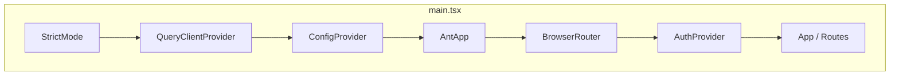
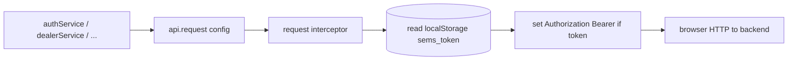
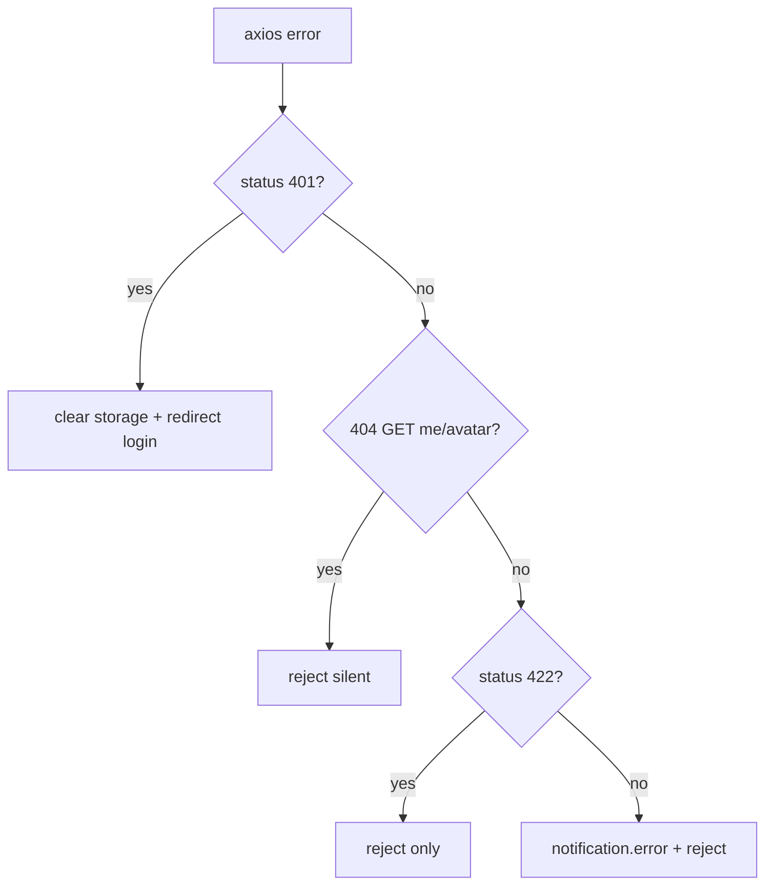
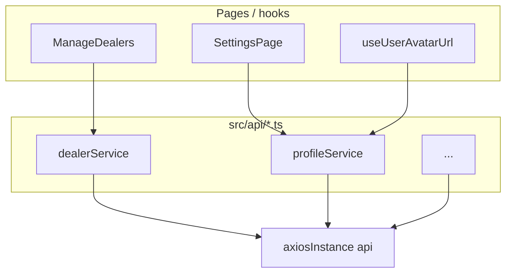
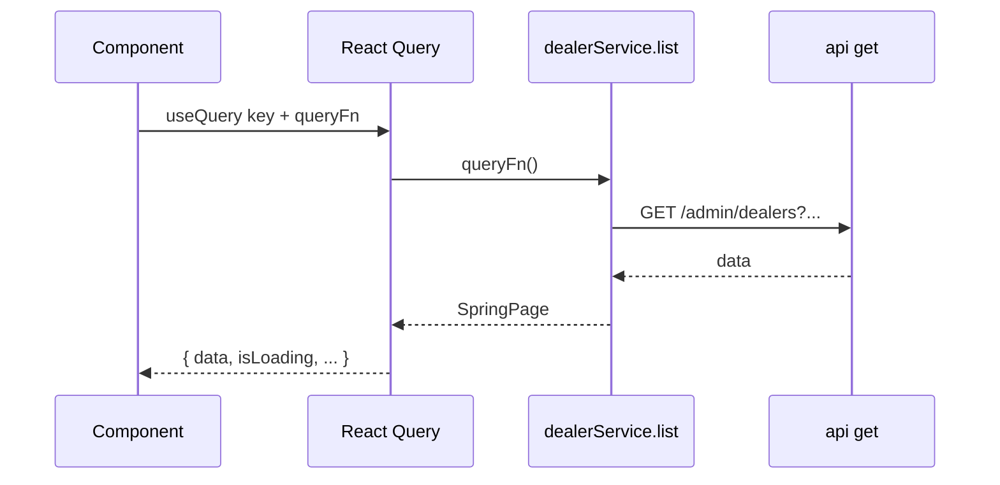
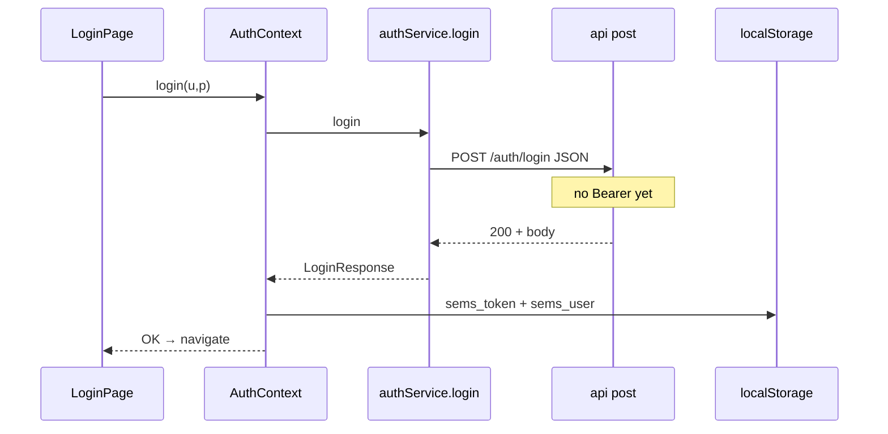
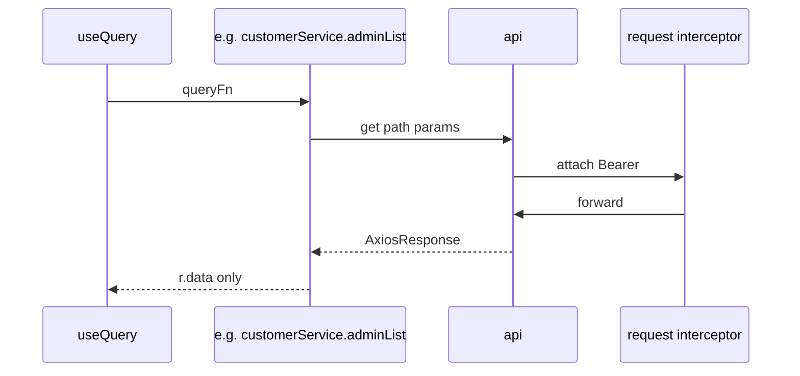
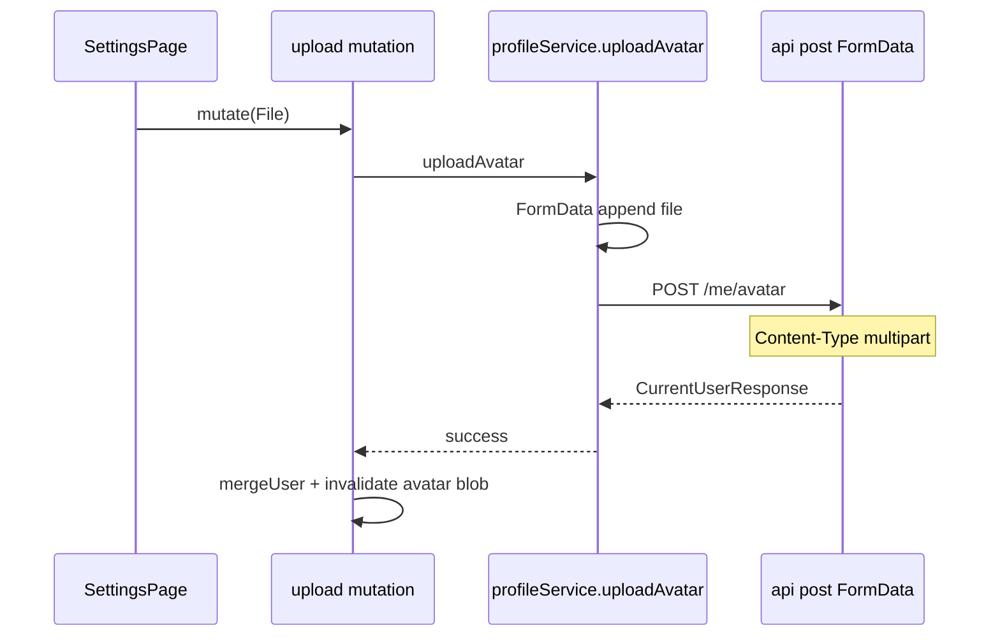
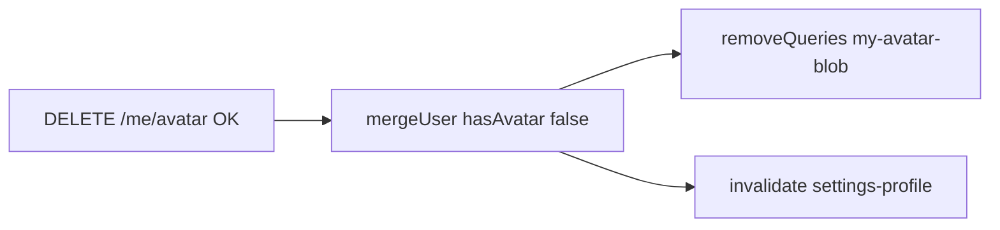
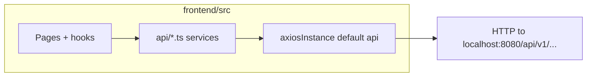

# Serene DMS — Frontend Viva Guide (Deep: Axios, UI & Backend Contract)

Study reference for your viva: **frontend-only** architecture with **all backend touchpoints expressed as the Axios `api` instance** under `src/api/`. Diagrams are **Mermaid** — paste blocks into [mermaid.live](https://mermaid.live) for pan/zoom; use a Mermaid preview extension in the IDE.

**Scope:** React app in `frontend/src/`, HTTP exclusively via **`axiosInstance.ts`** and **`*.ts` service modules** that import it. No Spring/Java implementation detail here—only what the frontend **sends** and **expects** over HTTP.

---

## Table of contents

1. [Tech stack](#1-tech-stack)
2. [How to view diagrams (interactive)](#2-how-to-view-diagrams-interactive)
3. [Bootstrap: provider tree](#3-bootstrap--provider-tree)
4. [Routing and layouts](#4-routing-and-layouts)
5. [Authentication flows (UI + Axios)](#5-authentication-flows-ui--axios)
6. [**Axios: single HTTP gateway (deep dive)**](#6-axios-single-http-gateway-deep-dive)
7. [Exhaustive API catalog (every `api.*` call)](#7-exhaustive-api-catalog-every-api-call)
8. [Service modules as facades](#8-service-modules-as-facades)
9. [React Query: how it sits on top of Axios](#9-react-query-how-it-sits-on-top-of-axios)
10. [Interactive flow diagrams](#10-interactive-flow-diagrams)
11. [Module map: pages → services](#11-module-map-pages--services)
12. [File-by-file index](#12-file-by-file-index)
13. [Layouts, settings, avatar blob](#13-layouts-settings-avatar-blob)
14. [Utilities: pagination & sort query strings](#14-utilities-pagination--sort-query-strings)
15. [TypeScript DTOs (`types/models.ts`)](#15-typescript-dtos-typesmodelsts)
16. [Viva Q&A (Axios & integration focus)](#16-viva-qa-axios--integration-focus)

---

## 1. Tech stack

| Layer | Technology | Role |
|-------|------------|------|
| Language | TypeScript | Types for UI + API responses |
| UI | React 19 | Components, hooks |
| Build | Vite 8 | `npm run dev` on port **3000** |
| Routing | react-router-dom v7 | `BrowserRouter`, nested routes |
| UI kit | antd 6 | Tables, forms, notifications |
| HTTP | **Axios** | **One** configured instance (`api`) |
| Server cache | TanStack Query v5 | Wraps async functions that call services |

---

## 2. How to view diagrams (interactive)

| Tool | What you do |
|------|-------------|
| [mermaid.live](https://mermaid.live) | Paste a ` ```mermaid ` block → pan/zoom/export |
| VS Code / Cursor | Mermaid preview extension on this `.md` |
| GitHub | Often renders Mermaid in `.md` preview |

---

## 3. Bootstrap & provider tree

**Entry:** `index.html` → `src/main.tsx` → `#root`.



**Query defaults:** `retry: 0`, `refetchOnWindowFocus: false` — predictable behavior for demos and debugging.

---

## 4. Routing and layouts

| Path pattern | Guard | Layout | Child examples |
|--------------|-------|--------|----------------|
| `/login`, `/register` | none | full-page | `LoginPage`, `RegisterPage` |
| `/` | `useAuth` | redirect | → `/admin` or `/dealer` or `/login` |
| `/admin/*` | `ProtectedRoute` roles `ADMIN` | `AdminLayout` | dashboard, manage\*, `settings` |
| `/dealer/*` | `ProtectedRoute` roles `DEALER` | `DealerLayout` | dashboard, customers, orders, `settings`, `profile` |
| `*` | — | redirect | → `/` |

```mermaid
flowchart TB
  PR[ProtectedRoute]
  PR -->|token missing| L[/login]
  PR -->|wrong role + is ADMIN| A[/admin]
  PR -->|wrong role + is DEALER| D[/dealer]
  PR -->|ok| OUT[Outlet child route]
```

---

## 5. Authentication flows (UI + Axios)

**Storage:** `localStorage` keys `sems_token` (JWT string) and `sems_user` (JSON of user fields without raw token).  
**Context:** `AuthContext` loads these on startup; `login` / `registerDealer` persist after successful Axios calls.

Axios calls (via `authService`):

| Action | Method + path (relative to base) | Body | Typical success |
|--------|-----------------------------------|------|-----------------|
| Login | `POST /auth/login` | `{ username, password }` | `LoginResponse` → `.data` |
| Register dealer | `POST /auth/register` | dealer fields | `LoginResponse` |
| Logout | `POST /auth/logout` | none | 200/204, then client clears storage |

**Note:** Login/register use **no** `Authorization` header yet; interceptor still runs but `sems_token` is absent until after persist.

---

## 6. Axios: single HTTP gateway (deep dive)

**File:** `src/api/axiosInstance.ts`  
**Export:** default `api` — **the only Axios instance** imported by service modules.

### 6.1 Instance configuration (what the frontend fixes at compile time)

| Option | Value | Viva line |
|--------|-------|-----------|
| `baseURL` | `http://localhost:8080/api/v1` | All relative URLs append here → full REST prefix |
| `timeout` | `30000` (ms) | Long requests fail with network/timeout error, not silent hang |

**Implication:** A service calling `api.get('/admin/dealers')` hits **`GET http://localhost:8080/api/v1/admin/dealers`**.

### 6.2 Request interceptor (outbound)



- Runs **on every** request made through `api`.
- Reads **`sems_token`**; if present, sets **`config.headers.Authorization = 'Bearer ' + token`**.
- Returns modified `config` — no async side effects.

### 6.3 Response interceptor (inbound: errors only)

Success path: **`(res) => res`** — callers use **`.then(r => r.data)`** in services to unwrap JSON body.

Error path:

| Condition | Frontend behavior |
|-----------|-------------------|
| `status === 401` | Remove `sems_token` and `sems_user`. If path not `/login`, **full navigation** `window.location.href = '/login'`. |
| `status === 404` AND `method === get` AND URL is `/me/avatar` (or ends with it) | **Reject** promise **without** `notification.error` (no photo is valid). |
| `status === 422` | Reject only — pages can map `fieldErrors` from body without global toast. |
| Any other `status` (with body message) | `notification.error` with server `message` or fallback text. |
| Always | `Promise.reject(err)` so `useMutation` / `await` see failure. |

**Error body typing:** `ApiErrorBody` in `types/models.ts` — `message`, optional `fieldErrors`, `status`, `path`, etc. Services do not parse it; the interceptor reads `err.response?.data`.



### 6.4 Service layer pattern (unwrapping `data`)

Every wrapper does:

```text
api.<method><T>(path, ...).then((r) => r.data)
```

So **callers never see** `AxiosResponse` — only **DTO** `T`. This keeps pages clean and matches TypeScript return types.

### 6.5 Query params and Spring Data

List endpoints pass **`params`** object → Axios serializes to **`?page=0&size=20&sort=createdAt,desc`** (and optional filters). The frontend treats **`page`** as **0-based** to align with typical Spring `Pageable` in this project.

### 6.6 Multipart (single special case)

**`profileService.uploadAvatar`:** builds `FormData`, `append('file', file)`, **`POST /me/avatar`**. Axios sets **`Content-Type: multipart/form-data`** with boundary automatically — **do not** manually set `Content-Type` or boundary breaks.

### 6.7 Blob response

**`profileService.fetchAvatarBlob`:** `api.get('/me/avatar', { responseType: 'blob' })` — binary body for `URL.createObjectURL` in `useUserAvatarUrl`.

---

## 7. Exhaustive API catalog (every `api` call)

All paths below are **relative to `baseURL`** (`/api/v1` on the server). **`params`** become query string; **body** is JSON unless noted.

### 7.1 `authService.ts`

| Function | HTTP | Path | Body / params | Returns type (`.data`) |
|----------|------|------|---------------|-------------------------|
| `login` | POST | `/auth/login` | `{ username, password }` | `LoginResponse` |
| `registerDealer` | POST | `/auth/register` | dealer registration object | `LoginResponse` |
| `logout` | POST | `/auth/logout` | — | `undefined` (void) |

### 7.2 `profileService.ts`

| Function | HTTP | Path | Notes | Returns |
|----------|------|------|-------|---------|
| `getMe` | GET | `/me` | current user JSON | `CurrentUserResponse` |
| `uploadAvatar` | POST | `/me/avatar` | **FormData** field `file` | `CurrentUserResponse` |
| `deleteAvatar` | DELETE | `/me/avatar` | — | void (`204`-style) |
| `fetchAvatarBlob` | GET | `/me/avatar` | `responseType: 'blob'` | `Blob` |

### 7.3 `dashboardService.ts`

| Function | HTTP | Path | Returns |
|----------|------|------|---------|
| `adminSummary` | GET | `/admin/dashboard/summary` | `DashboardSummary` |
| `dealerSummary` | GET | `/dealer/dashboard/summary` | `DashboardSummary` |

### 7.4 `auditLogService.ts`

| Function | HTTP | Path | params (axios `params`) | Returns |
|----------|------|------|---------------------------|---------|
| `list` | GET | `/admin/audit-logs` | `page`, `size`, `sort` default `createdAt,desc`; optional `action`, `actorUsername`, `from`, `to` | `SpringPage<AuditLog>` |

### 7.5 `dealerService.ts`

| Function | HTTP | Path | params / body | Returns |
|----------|------|------|---------------|---------|
| `adminList` | GET | `/admin/dealers` | `page`, `size`, `sort`, `q` | `SpringPage<Dealer>` |
| `adminGet` | GET | `/admin/dealers/{id}` | — | `Dealer` |
| `adminCreate` | POST | `/admin/dealers` | JSON body (user+dealer fields) | `Dealer` |
| `adminUpdate` | PUT | `/admin/dealers/{id}` | JSON partial | `Dealer` |
| `adminDelete` | DELETE | `/admin/dealers/{id}` | — | — |
| `profile` | GET | `/dealer/profile` | — | `Dealer` |
| `updateProfile` | PUT | `/dealer/profile` | JSON partial | `Dealer` |

### 7.6 `customerService.ts`

| Function | HTTP | Path | params / body |
|----------|------|------|---------------|
| `adminList` | GET | `/admin/customers` | `page`, `size`, `sort`, `dealerId`, `q` |
| `adminGet` | GET | `/admin/customers/{id}` | — |
| `adminCreate` | POST | `/admin/customers` | JSON |
| `adminUpdate` | PUT | `/admin/customers/{id}` | JSON |
| `adminDelete` | DELETE | `/admin/customers/{id}` | — |
| `dealerList` | GET | `/dealer/customers` | `page`, `size`, `sort`, `q` |
| `dealerGet` | GET | `/dealer/customers/{id}` | — |
| `dealerCreate` | POST | `/dealer/customers` | JSON |
| `dealerUpdate` | PUT | `/dealer/customers/{id}` | JSON |
| `dealerDelete` | DELETE | `/dealer/customers/{id}` | — |

All list/get/create/update return `Customer` or `SpringPage<Customer>` as appropriate.

### 7.7 `orderService.ts`

| Function | HTTP | Path | Notes |
|----------|------|------|-------|
| `adminList` | GET | `/admin/orders` | `dealerId`, `status` filters |
| `adminGet` | GET | `/admin/orders/{id}` | |
| `adminCreate` | POST | `/admin/orders` | body: `dealerId?`, `customerId`, `items[]` |
| `adminUpdateStatus` | PATCH | `/admin/orders/{id}/status` | body: `{ status }` |
| `dealerList` | GET | `/dealer/orders` | `status` |
| `dealerGet` | GET | `/dealer/orders/{id}` | |
| `dealerCreate` | POST | `/dealer/orders` | body: `customerId`, `items[]` |
| `dealerUpdateStatus` | PATCH | `/dealer/orders/{id}/status` | `{ status }` |

### 7.8 `productService.ts`

| Function | HTTP | Path | Notes |
|----------|------|------|-------|
| `list` | GET | `/products` | shared catalog read: `category`, `q` |
| `get` | GET | `/products/{id}` | |
| `adminCreate` | POST | `/admin/products` | |
| `adminUpdate` | PUT | `/admin/products/{id}` | |
| `adminDelete` | DELETE | `/admin/products/{id}` | |

### 7.9 `userService.ts`

| Function | HTTP | Path |
|----------|------|------|
| `list` | GET | `/admin/users` |
| `get` | GET | `/admin/users/{id}` |
| `create` | POST | `/admin/users` |
| `update` | PUT | `/admin/users/{id}` |
| `remove` | DELETE | `/admin/users/{id}` |
| `unlock` | POST | `/admin/users/{id}/unlock` |

---

## 8. Service modules as facades



**Rule:** Pages **should not** import `axios` directly—only **`api`** through a **named service** so URLs and types stay centralized.

---

## 9. React Query: how it sits on top of Axios

| Concept | Role |
|---------|------|
| `queryFn` | Usually `() => someService.method()` — ultimately **one or more `api` calls** |
| `queryKey` | Cache identity; **admin-/dealer-** prefix ties into portal Refresh |
| `useMutation` | Wraps POST/PUT/PATCH/DELETE service calls; `onSuccess` invalidates keys |
| `invalidateQueries` | Marks stale → refetch → **new Axios GETs** |
| `removeQueries` | Deletes cache entry — **no refetch** (used after avatar delete to avoid `GET /me/avatar` 404 toast) |



---

## 10. Interactive flow diagrams

### 10.1 Login through Axios (sequence)



### 10.2 Authenticated GET (sequence)



### 10.3 Avatar upload (multipart sequence)



### 10.4 Avatar removal cache strategy



Reason: **`invalidateQueries`** on blob would refire **GET /me/avatar** → **404** → global toast before your “silent 404” edge case helps; **removeQueries** avoids the refetch.

### 10.5 Portal “Refresh” button

```mermaid
flowchart TB
  BTN[Header Refresh click]
  BTN --> PRED{predicate: queryKey[0] starts with admin or dealer}
  PRED --> INV[invalidateQueries all matches]
  INV --> RF[Each active query refetches via Axios]
```

---

## 11. Module map: pages → services

| Page | Primary Axios modules |
|------|------------------------|
| `LoginPage` / `RegisterPage` | `authService` |
| `AdminDashboard` | `dashboardService`, `auditLogService` |
| `ManageDealers` | `dealerService` |
| `ManageCustomers` | `customerService` (admin*) |
| `ManageProducts` | `productService` |
| `ManageOrders` | `orderService` (admin*) |
| `ManageUsers` | `userService` |
| `ManageAuditLogs` | `auditLogService` |
| `SettingsPage` | `profileService` |
| `DealerDashboard` | `dashboardService` |
| `MyCustomers` | `customerService` (dealer*) |
| `DealerProducts` | `productService` |
| `MyOrders` | `orderService` (dealer*) |
| `DealerProfile` | `dealerService` (profile/updateProfile) |
| `AdminLayout` / `DealerLayout` | indirect: `useUserAvatarUrl` → `profileService.fetchAvatarBlob` |

---

## 12. File-by-file index

- **`main.tsx`** — providers; creates `QueryClient`.
- **`App.tsx`** — routes only.
- **`api/axiosInstance.ts`** — **only** place `axios.create` runs.
- **`api/*.ts`** — callable API; each maps to table in §7.
- **`auth/*`** — session UI; call `authService`.
- **`layouts/*`** — chrome; Refresh uses `portalQueryRefresh`; avatar hook uses `profileService`.
- **`pages/*`** — compose antd + `useQuery`/`useMutation` + services.
- **`hooks/useUserAvatarUrl.ts`** — React Query + `fetchAvatarBlob`.
- **`utils/portalQueryRefresh.ts`** — `invalidateQueries` predicates.
- **`utils/tablePagination.ts`**, **`serverTableSort.ts`** — build `page`, `size`, `sort` **for Axios `params`**.
- **`types/models.ts`** — shapes of JSON **`r.data`**.

---

## 13. Layouts, settings, avatar blob

- **Settings** routes: `/admin/settings`, `/dealer/settings` → shared **`SettingsPage`**.
- Header **Avatar** `src`: object URL from blob when `user.hasAvatar`; interceptor allows silent 404 only for **GET** `/me/avatar`.

---

## 14. Utilities: pagination & sort query strings

Lists pass **`page`**, **`size`**, **`sort`** into service methods → Axios **`params`** → server returns **`SpringPage<T>`** (`content`, `totalElements`, `number`, `size`). Frontend maps **`number`** to current page index for Ant Table pagination.

---

## 15. TypeScript DTOs (`types/models.ts`)

DTOs mirror **JSON bodies** returned by `.then(r => r.data)`. Keeping them accurate prevents silent drift between UI and API. Key types: **`LoginResponse`**, **`CurrentUserResponse`**, **`SpringPage<T>`**, **`Order`**, **`User`**, **`Customer`**, **`Dealer`**, **`Product`**, **`AuditLog`**, **`ApiErrorBody`**.

---

## 16. Viva Q&A (Axios & integration focus)

**Q1. Where is Axios configured?**  
**A.** Only in `axiosInstance.ts` — `baseURL`, `timeout`, request/response interceptors.

**Q2. How does JWT reach every API call after login?**  
**A.** Request interceptor reads `sems_token` and sets `Authorization: Bearer …` on the outgoing Axios config.

**Q3. Why `.then(r => r.data)` everywhere?**  
**A.** To return the **resource** (DTO), not the full `AxiosResponse`, so pages stay free of HTTP wrapper types.

**Q4. What happens on 401 for any request?**  
**A.** Storage cleared; user redirected to `/login` (unless already there) — session is treated as invalid.

**Q5. Why special-case 404 on GET `/me/avatar`?**  
**A.** Missing image is valid; avoids scary global error toast when React Query or timing triggers a GET with no avatar.

**Q6. How is file upload different from JSON POST?**  
**A.** `FormData` + default multipart headers; field name **`file`** matches backend expectation.

**Q7. How do you read binary image in the UI?**  
**A.** `responseType: 'blob'` on `api.get` → `Blob` → `URL.createObjectURL` for `` / Ant `Avatar src`.

**Q8. What HTTP methods does the frontend use?**  
**A.** GET, POST, PUT, PATCH, DELETE — see §7 tables.

**Q9. How does “Refresh” in the header work?**  
**A.** `invalidateQueries` with a predicate on query key prefix (`admin` / `dealer`) so all matching queries re-run their `queryFn` → new Axios traffic.

**Q10. Could you swap backend host without touching every service?**  
**A.** Yes — change **`baseURL`** in `axiosInstance.ts` (or later: env-driven `import.meta.env.VITE_API_URL` pattern).

---

## Diagram: only one HTTP door



---

*Frontend-only guide; all server behavior described through Axios contracts in `src/api`. Update §7 when you add or change service methods.*
